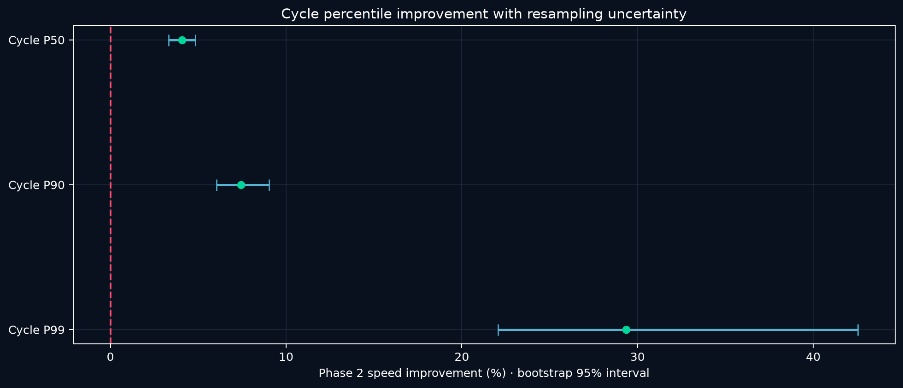

# FH6 Auto

Windows automation for the Forza Horizon 6 Super Wheelspin loop: farm Skill Points, buy the 95,000-CR Mad Mike Mazda, select the newest copy, claim and verify its 21-SP mastery path, bank the reward, and repeat. **F6 starts. F7 stops.**

## 1. Install and run

### Requirements

- Windows 10 or 11
- Python 3.10 or newer
- Forza Horizon 6 through Steam
- English game menus at 1920×1080
- The maxed 1998 Subaru Impreza 22B set as the only Favorite
- Mega Farm V6 share code `155 439 962`

### Install

1. Download and extract the latest release.
2. Run `Setup FH6 Auto.cmd` once. It creates a private Python environment, installs the required packages, and opens the dashboard.
3. For later runs, use `Start FH6 Auto.cmd`.

For development installs, clone the repository and run the same setup file. Tests require `requirements-dev.txt` and run with `python -m pytest`.

### Run

1. Open Steam and sign in.
2. Start FH6 Auto.
3. Choose a mode and target in Mission Control.
4. Put Forza in a supported home or festival state.
5. Press **F6**.
6. Press **F7** whenever you want the worker to stop safely.

The program can launch FH6 through Steam and resume after a crash. A visible cloud-sync gate always takes priority; it waits for synchronization and never chooses offline play.

### Production loop

1. Read the current SP balance.
2. Run Mega Farm V6 in full-run or headroom-aware top-up mode.
3. Buy exactly one Mad Mike Mazda through Car Collection.
4. Open My Cars → Recently Added and select the newest untouched copy.
5. Claim and visually verify all six required mastery nodes.
6. Record the Super Wheelspin reward and return to the next purchase.
7. At the configured cleanup interval, remove processed Mad Mikes and verify the filtered inventory.
8. In credit-limited mode, stop buying below 95,000 CR, finish any paid copy, top SP up to 999, remove the remaining Mad Mikes, verify zero, and stop.

Rewards stay saved; the program does not open the wheelspins.

### Safety and recovery

- Checks window identity, foreground focus, resolution, language, and expected screen before critical input.
- Uses OpenCV for calibrated visual states and OCR for variable numbers and text.
- Compares mastery-node interiors, excluding the changing focus border.
- Verifies each node changed from locked to owned before advancing.
- Checks the exact car, 95,000-CR offer, selected Buy action, and purchase confirmation.
- Never repeats an uncertain purchase.
- Requires two matching credit reads before a credit-limited purchase decision.
- Uses hybrid inventory tracking: verified rewards update immediately, then a fresh My Horizon read corrects the total.
- Saves checkpoints, error screenshots, failure causes, and recovery timing.
- Detects a stationary farm car and performs bounded reverse recovery.
- Keeps Discord rendering, analytics, screenshots, and account reads off the input-critical path where safe.

### Optional Discord reporting

Add a webhook in the dashboard to receive the live mission board and current game capture. The webhook is encrypted with Windows DPAPI for the current Windows user and is excluded from Git and release archives.

### Project map

| Path | Purpose |
|---|---|
| `FH6 Auto.pyw` | Mission Control desktop app |
| `fh6/` | Navigation, recognition, farming, recovery, analytics, and reporting |
| `forza_cycle.py` | Shared configuration and mission state |
| `recognition/`, `templates/`, `calibration/` | Screen and mastery references |
| `profiles/` | Farm profiles |
| `tests/` | Public regression suite |
| [`MODULES.md`](MODULES.md) | Module-level map |
| [`RECOGNITION.md`](RECOGNITION.md) | Recognition and calibration notes |
| [`CHART-METHODS.md`](CHART-METHODS.md) | Chart and metric conventions |
| [`SECURITY.md`](SECURITY.md) | Private-state and credential handling |

Private gameplay captures, `runs/`, `failures/`, `purchases/`, `LocalState/`, virtual environments, process identifiers, and Discord credentials stay outside Git.

## 2. Data analysis

This section compares the two large production cohorts using the same definitions. It answers one decision: **which Phase 2 changes should stay, and where should the next optimization effort go?**

The result is clear: keep the Phase 2 conversion and recovery changes. They reduced the typical cycle modestly and cut the slow tail sharply. Farm throughput fell, however, and remains the system bottleneck.

### Metric definitions

| Metric | Definition | Why it matters |
|---|---|---|
| Active SW/h | Verified new mastery rewards divided by recorded active mission hours | Output while the worker is actively farming, converting, or recovering |
| Wall SW/h | Verified new rewards divided by elapsed mission time | User-visible end-to-end throughput |
| Cycle P50 / P90 / P99 | 50th, 90th, and 99th percentiles of buy → mastery → return time | Typical speed and tail latency |
| First-pass yield | Cars completed without a retry or recovery event | Reliability of the conversion line |
| Retained SP/h | Post-run minus pre-run SP divided by active farm time | Useful farm output after the 999-SP cap |
| Farm capacity | Retained SP/h ÷ 21 SP per Mazda | Maximum cars the farm can support per hour |
| Conversion capacity | 3,600 ÷ effective conversion seconds per car | Maximum cars the conversion loop can process per hour |
| Crash/retry incidence | Events per 1,000 completed cars | Normalizes reliability for different cohort sizes |
| Improvement | `(Phase 1 − Phase 2) ÷ Phase 1`; positive means Phase 2 is better | Comparable direction across timing and failure metrics |

### Cohorts and terminal proof

| Scope | Phase 1 comparable cohort | Phase 2 |
|---|---:|---:|
| Mission | Restart from 333 | Credit-exhaustion run |
| Completed cars | **1,398** | **1,281** |
| Farm runs | **116** | **104** |
| Recorded active time | **54.72h** | **46.33h** |
| Recorded wall time | part of 87.04h full-operation window | **57.81h** |
| Final credits | **87,720 CR** | **11,170 CR** |
| Final SP | **39** | **999** |
| Final Mad Mikes | **0 verified** | **0 verified** |

Phase 2 ran from **2026-09-15 10:51 to 2026-09-17 20:39 JST**. It produced **1,281 verified Super Wheelspins** from **1,281 purchased and processed Mazdas**. The final hybrid inventory was **2,482 SW and 221 WS**: My Horizon directly showed 2,481 SW, and one later verified mastery reward was added.

### Headline comparison

| Metric | Phase 1 | Phase 2 | Phase 2 change | Statistical note |
|---|---:|---:|---:|---|
| Cycle P50 | 47.37s | **45.44s** | **4.07% faster** | bootstrap 95% CI: **3.31% to 4.83%** |
| Cycle P90 | 58.69s | **54.33s** | **7.44% faster** | bootstrap 95% CI: **6.05% to 9.03%** |
| Cycle P99 | 83.46s | **58.96s** | **29.36% faster** | bootstrap 95% CI: **22.07% to 42.53%** |
| Active throughput | 25.55 SW/h | **27.65 SW/h** | **8.21% higher** | mission active-time denominator |
| Farm retained rate | **1,116.9 SP/h** | 1,044.8 SP/h | **6.45% lower** | 116 vs 104 farm runs |
| Farm capacity | **53.19 cars/h** | 49.75 cars/h | **6.45% lower** | retained SP/h ÷ 21 |
| Conversion capacity | **64.48 cars/h** | 63.31 cars/h | **1.81% lower** | recorded conversion time |
| Crashes / 1,000 cars | 14.31 | **5.46** | **61.80% fewer** | broad mission counters |
| Retries / 1,000 cars | 1,247.50 | **231.85** | **81.41% fewer** | broad mission counters |

Percentile uncertainty uses a deterministic nonparametric bootstrap with 5,000 resamples. The intervals describe sampling uncertainty in the observed cycle distributions; they do not prove that every code change caused the improvement.

The median improved by about two seconds, while the P99 dropped by 24.5 seconds. Phase 2's strongest gain was tail control.

### Stage-level comparison

| Stage | Phase 1 P50 | Phase 2 P50 | P50 gain | Phase 1 P90 | Phase 2 P90 | P90 gain | Phase 1 P99 | Phase 2 P99 | P99 gain |
|---|---:|---:|---:|---:|---:|---:|---:|---:|---:|
| Collection | 0.063s | 0.062s | +1.6% | 0.125s | 0.125s | 0.0% | **0.687s** | 0.765s | −11.4% |
| Buy | 4.031s | **3.797s** | +5.8% | 5.594s | **4.437s** | +20.7% | 14.563s | **13.256s** | +9.0% |
| Bought transition | 0.985s | **0.860s** | +12.7% | 1.125s | **1.047s** | +6.9% | 1.218s | **1.128s** | +7.4% |
| Choose newest | 21.157s | **20.875s** | +1.3% | 29.041s | **25.922s** | +10.7% | 34.253s | **32.481s** | +5.2% |
| Open mastery | 3.438s | **3.172s** | +7.7% | 3.807s | **3.547s** | +6.8% | 14.940s | **14.494s** | +3.0% |
| Mastery path | 7.312s | **6.859s** | +6.2% | 11.463s | **7.110s** | +38.0% | 11.672s | **7.269s** | +37.7% |
| Return | 9.719s | **9.313s** | +4.2% | 12.875s | **9.890s** | +23.2% | 23.336s | **10.397s** | +55.4% |

`Choose newest` still owns almost half of the median cycle and is the largest conversion-stage opportunity. Phase 2's biggest measured wins were mastery and return tail latency, which explains the large P99 improvement.

### Capacity and bottleneck

Phase 2 conversion could process **63.3 cars/h**, while the farm supported **49.8 cars/h**. The theoretical line imbalance was therefore **21.4% of conversion capacity**, and farming constrained sustained output. Faster conversion alone cannot raise long-run output until useful SP production catches up.

Phase 2's **27.65 active SW/h** exceeded Phase 1 despite lower standalone farm and conversion capacity. Fewer retries and crashes recovered enough otherwise lost time to raise end-to-end output.

### Phase 2 farm detail

The 104 farm runs retained **27,524 SP** over **26.34 active hours**.

| Run type | Runs | Retained SP | Active hours | Retained SP/h | Cars supported/h | Drive P50 | Drive P90 |
|---|---:|---:|---:|---:|---:|---:|---:|
| Natural completion | 68 | 19,675 | 19.01h | 1,034.7 | 49.27 | 917.2s | 917.4s |
| Intentional top-up | 29 | 6,167 | 5.38h | **1,147.4** | **54.64** | 700.3s | 839.5s |
| Interrupted | 7 | 1,682 | 1.95h | 861.1 | 41.00 | 917.2s | 917.3s |

Intentional top-ups were **10.9% more productive** than natural completions on retained SP/h and **33.3% more productive** than interrupted runs. This supports keeping headroom-aware top-ups and prioritizing removal of interruption and setup overhead. Estimated cap loss was only available for part of the cohort and totals **34.7 SP**; it is not a complete raw-yield ledger.

### Reliability and failure cost

Phase 2 recorded **297 broad retries** and **7 crashes**. Cause-level timing covers 42 completed recovery rows and 15.8 minutes, so it is a subset of the broad counters.

| Classified cause | Events | Recovery time | Mean cost |
|---|---:|---:|---:|
| Other | 27 | 11.9 min | 26.5s |
| Mastery detection | 13 | 3.2 min | 14.8s |
| Choose timeout | 1 | 0.5 min | 28.3s |
| Return timeout | 1 | 0.2 min | 12.0s |

Phase 2 first-pass yield was **97.11%**. Normalized crash incidence fell from 14.31 to 5.46 per 1,000 cars, and retry incidence fell from 1,247.50 to 231.85 per 1,000.

### Finance and inventory reconciliation

Each Mazda cost exactly 95,000 CR.

| Phase 2 credit bridge | Amount |
|---|---:|
| Opening credits | 120,157,670 CR |
| Other in-game inflow required to reconcile | **+1,548,500 CR** |
| 1,281 Mazda purchases | **−121,695,000 CR** |
| Final verified credits | **11,170 CR** |

The cleanup log contains **1,277 row-level removals**. Four purchases fall outside that removal-event coverage, while the final duplicate-off and manufacturer-index checks independently verified that **zero Mad Mikes remained**.

### What changed in Phase 2

- Matching full-header credit reads replaced single-read purchase decisions.
- A completed mission reopens if a post-farm credit reward funds another exact Mazda.
- Terminal shutdown restores SP to 999 before cleanup.
- Cleanup checkpoints every 500 cars and switches to a single-copy filter when duplicates are exhausted.
- Empty filtered garages are recognized explicitly and recovered through Filter Selection.
- Stationary-car detection applies a bounded reverse recovery during farming.
- Account reads, Discord rendering, screenshots, and analytics moved off the input-critical path where safe.
- OpenCV handles stable visual states; OCR handles variable values with multi-read confirmation for financial decisions.
- Game captures older than 15 minutes are rejected for reports.

### Decision from the comparison

Keep the Phase 2 purchase, mastery, return, checkpoint, cleanup, and recovery logic. It produced a statistically clear cycle improvement and materially reduced failure incidence. The next optimization target is SP farming: improve useful retained yield, shorten setup and exit boundaries, and prevent interrupted runs while preserving the faster intentional top-up policy.

### Evidence quality and limitations

**Directly verified:** purchase count, mastery reward count, cycle rows, farm pre/post SP reads, final credit proof, terminal SP proof, My Horizon inventory reads, and final zero-car cleanup.

**Derived from direct records:** percentile distributions, capacities, throughput, gross Mazda spend, reconciled non-purchase credit inflow, and normalized failure incidence.

**Incomplete:** historic cap loss, failure causes before taxonomy existed, removals before cleanup telemetry, and the exact source of reconciled credit inflow. Missing values stay unknown rather than being converted to zero. Phase 1 and Phase 2 happened at different times, so the comparison is observational rather than a randomized experiment.

### Reproducible exports

- [Full Phase 2 report](docs/phase-2-report/REPORT.md)
- [Reviewed Phase 2 snapshot](docs/phase-2-report/reviewed_snapshot.json)
- [Detailed Phase 1 vs Phase 2 metrics](docs/phase-2-report/data/comparison_detailed.csv)
- [Stage comparison](docs/phase-2-report/data/stage_comparison.csv)
- [Machine-readable comparison analysis](docs/phase-2-report/comparison_analysis.json)
- [Phase 2 stage percentiles](docs/phase-2-report/data/stage_percentiles.csv)
- [Phase 2 farm profiles](docs/phase-2-report/data/farm_profiles.csv)
- [Phase 2 classified failures](docs/phase-2-report/data/classified_failures.csv)
- [Historical full-operation report](docs/full-operation-report/REPORT.md)
- [Historical full-operation reviewed snapshot](docs/full-operation-report/reviewed_snapshot.json)
- [Chart methodology](CHART-METHODS.md)

The historical report preserves the earlier **0 → 517 → 333 → 1,680 SW** narrative. The Phase 2 report records the later credit-exhaustion run through **2,482 saved SW**, 999 SP, 11,170 CR, and zero remaining Mad Mikes.
