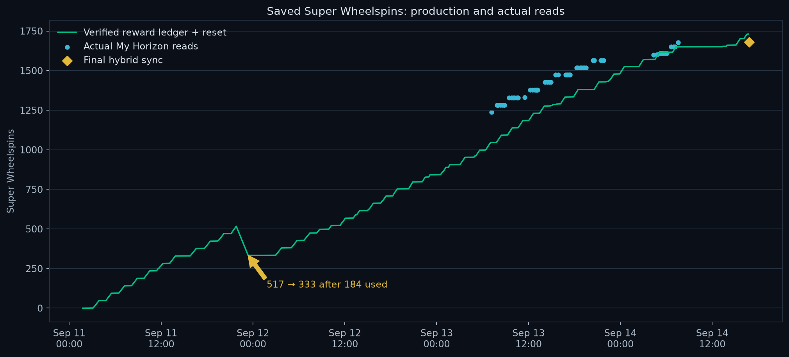
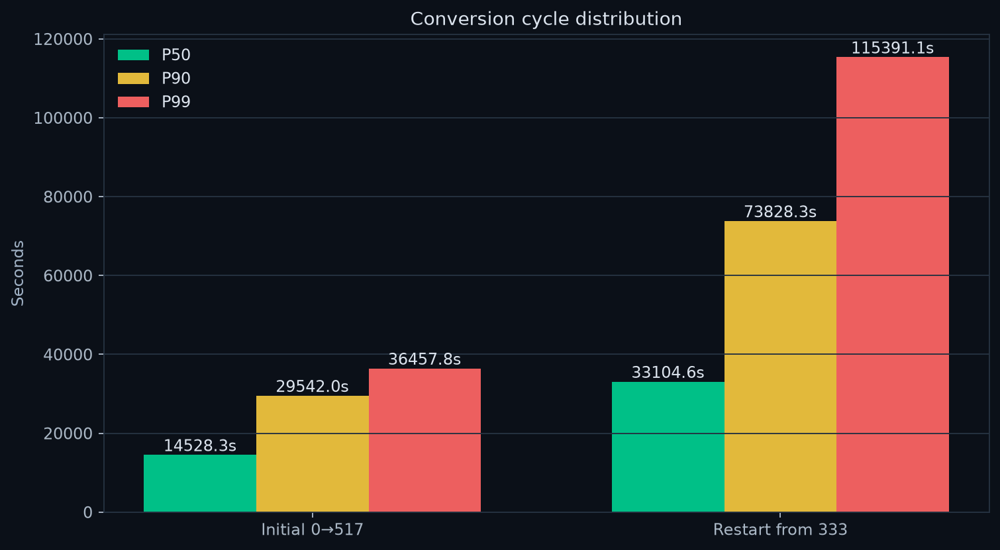
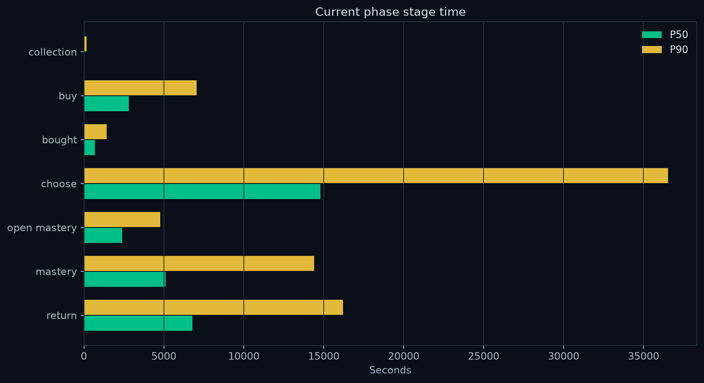
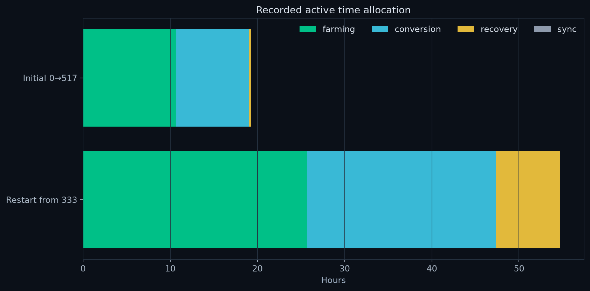
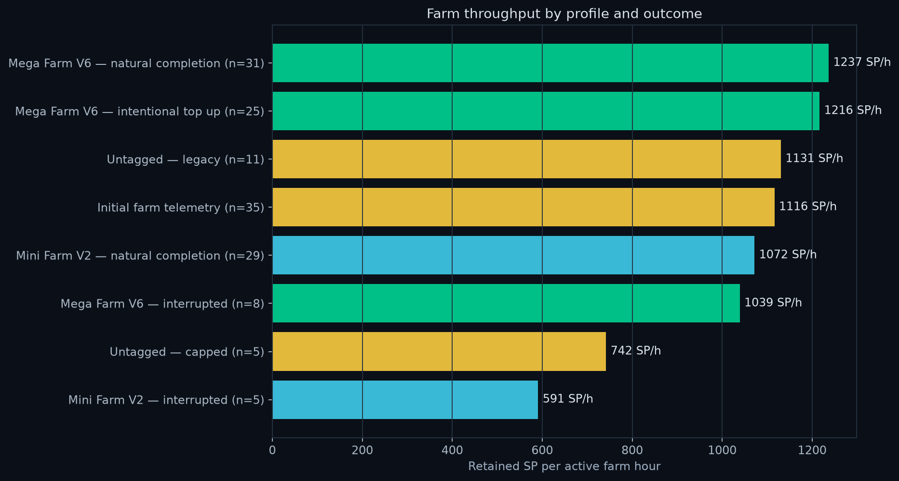
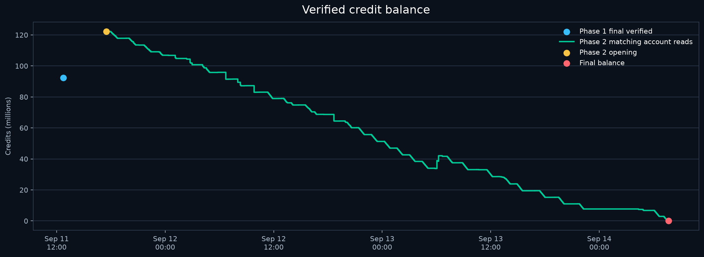
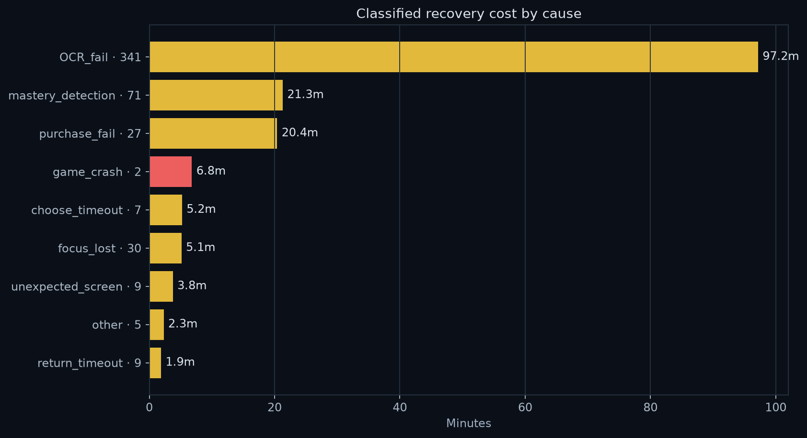

# FH6 Auto

Windows automation for a complete Forza Horizon 6 Super Wheelspin production loop.

1. Farm Skill Points with Mega Farm V6 (`155 439 962`) and the favorite 1998 Subaru 22B.
2. Read the actual SP balance and choose a full run or a headroom-aware top-up.
3. Buy the 95,000-CR Mad Mike Mazda from Car Collection.
4. Select the newest untouched copy through My Cars → Recently Added.
5. Claim and verify the six-node mastery path, costing 21 SP and banking one Super Wheelspin.
6. Return to Car Collection and repeat.
7. In credit-limited mode, stop buying below 95,000 CR, finish any paid copy, remove all Mad Mikes, verify none remain, and stop.

Rewards remain saved. **F6 starts and F7 stops.**

## Start

Use English menus at 1920×1080. Make the maxed 1998 Subaru Impreza 22B your only Favorite.

1. Run `Setup FH6 Auto.cmd` once.
2. Open Steam and sign in.
3. Run `Start FH6 Auto.cmd`.
4. Choose the mission mode and target.
5. Press F6.

The program can open FH6 through Steam and resume after crashes. A visible cloud synchronization gate always takes priority; the automation does not select offline play or bypass unresolved synchronization.

## Main safeguards

- Window identity, foreground focus, resolution, language, and expected-screen checks
- Interior-only mastery recognition that excludes the focus border
- Locked/unlocked verification before advancing to the next node
- Exact Mazda, 95,000-CR offer, selected Buy action, and single-attempt purchase ledger
- No repeated purchase after uncertain confirmation
- Recently Added + NEW/fresh-mastery checks for the newest Mad Mike
- Two matching credit reads before a credit-limited purchase decision
- Hybrid saved-inventory tracking corrected by direct My Horizon reads
- Error screenshots, bounded retries, crash recovery, and F7 cancellation throughout

## Speed and farm policy

Analytics, report rendering, account OCR, and diagnostics run in background workers where possible. Navigation uses screen-specific polling and stable-target checks instead of long fixed sleeps.

Mega Farm V6 is the production profile. Full runs handle bulk refill; shortened top-ups stop near the SP needed for the next car batch. Mini Farm V2 (`169 055 890`) remains available for measurement but was slower in the completed trial on retained SP per active farm hour.

Phase 2 measured a full-run conversion P50 of 45.4 seconds and P90 of 54.3 seconds; its final 20 cars measured 46.6 seconds and 56.0 seconds. The 30-second target was not reached.

## Analytics and Discord

The Analytics page records cycle and stage P50/P90/P99, transition and recovery timing, first-pass yield, retries by cause, recovery cost, active and wall-clock SW/hour, retained SP/hour, farm and conversion capacity, cap flags, crashes, credits, SP, level, prestige, purchases, processing, and removals.

Discord reporting is optional. The webhook is encrypted with Windows DPAPI under the current user profile and is never stored in the repository.

## Phase 2 complete: run to credit exhaustion

**Period:** 2026-09-15 10:51 to 2026-09-17 20:39 JST 
**Result:** 1,281 new Super Wheelspins from 1,281 purchased and processed Mazdas 
**Terminal proof:** 11,170 CR, 999 SP, zero Mad Mikes remaining

| Measurement | Phase 2 |
|---|---:|
| Final saved inventory | **2,482 SW · 221 WS** |
| Cycle P50 / P90 / P99 | **45.44s / 54.33s / 58.96s** |
| First-pass yield | **97.11%** |
| Conversion capacity | **63.3 cars/h** |
| Farm capacity | **49.8 cars/h** |
| Retained farm rate | **1,045 SP/h** |
| Verified output | **27.65 SW/h active · 22.16 SW/h wall** |
| Farm runs | **104** |
| Gross Mazda spend | **121,695,000 CR** |
| Broad retries / crashes | **297 / 7** |
| Recorded Phase 2 removals | **1,277** |

The last direct My Horizon read was 2,481 SW; the final verified mastery reward gives the 2,482 hybrid total. The complete report includes every stage percentile, farm profile, credit bridge, failure cost, cleanup evidence, charts, methods, limitations, and a Phase 1 comparison.

- [Open the full Phase 2 report](docs/phase-2-report/REPORT.md)
- [Inspect the reviewed Phase 2 snapshot](docs/phase-2-report/reviewed_snapshot.json)

## Complete operation data

**0 → 517 → 333 → 1,680 saved Super Wheelspins**

**Period:** 2026-09-11 01:46 to 2026-09-14 16:48 JST
**Account:** aichan3301
**End state:** credit limit reached, final paid car completed, garage cleanup verified

## Final result

The operation produced **1,915 verified Super Wheelspin mastery rewards** from **1,915 purchased Mad Mike Mazdas**.

The first mission moved saved inventory from **0 to 517**. The inventory was then reduced to **333** after **184 spins were used**. The second mission verified **1,398** more mastery rewards. The last direct My Horizon read was **1,678 SW and 219 WS** at reward 1,396; two later verified mastery claims give a final hybrid inventory of **1,680 SW and 219 WS**.

The second mission's reward ledger would have reached 1,731 SW from the 333 opening balance. Actual inventory finished at 1,680, so **51 additional SW were used or otherwise reduced during that mission**. The known inventory reduction across both usage periods is **235 SW**.

| Final state | Value |
|---|---:|
| Saved Super Wheelspins | **1,680** |
| Wheelspins | **219** |
| Verified mastery rewards | **1,915** |
| Mad Mike Mazdas bought and processed | **1,915** |
| Credits | **87,720 CR** |
| Skill Points | **39 SP** |
| Level / prestige | **387 / 5** |
| Mad Mike cars remaining | **0, verified** |
| Recorded removal events | **1,288** |
| Removed in final automated pass | **78** |

## Production timeline

| Phase | Result | Farm runs | Cycle P50 | Cycle P90 | Cycle P99 | Active time | Recovery | Crashes |
|---|---:|---:|---:|---:|---:|---:|---:|---:|
| Initial 0→517 | 517 SW | 35 | 56.1s | 63.6s | 72.4s | 19.26h | 0.23h | 2 |
| Restart from 333 | 1,398 rewards | 116 | 47.4s | 58.7s | 83.5s | 54.72h | 7.33h | 20 |
| **Total** | **1,915 rewards** | **151** | — | — | — | **73.97h** | **7.56h** | **22** |

The end-to-end wall window was **87.04 hours**. Output averaged **25.89 verified rewards per recorded active hour** and **22.00 per wall hour**. The latest 20-car window finished at **P50 46.73s, P90 57.52s, P99 57.73s**, with **100% first-pass yield**.

The second phase cut the whole-cycle P50 by **15.6%** and P90 by **7.8%** versus the first phase. The stable final median was about 46.7 seconds; the 30-second target was not reached.

### Per-stage distributions

| Phase | Stage | n | P50 | P90 | P99 | Mean |
|---|---|---:|---:|---:|---:|---:|
| 0→517 | Collection | 517 | 0.47s | 0.52s | 0.59s | 0.48s |
| 0→517 | Buy | 517 | 6.91s | 7.36s | 17.02s | 6.96s |
| 0→517 | Bought transition | 517 | 1.27s | 1.31s | 1.34s | 1.21s |
| 0→517 | Choose newest car | 517 | 24.03s | 29.98s | 35.84s | 25.33s |
| 0→517 | Open mastery | 512 | 3.31s | 3.62s | 13.44s | 3.48s |
| 0→517 | Mastery path | 517 | 8.38s | 8.58s | 9.00s | 8.40s |
| 0→517 | Return | 517 | 11.47s | 12.44s | 16.57s | 11.77s |
| Restart from 333 | Collection | 1,398 | 0.06s | 0.13s | 0.69s | 0.15s |
| Restart from 333 | Buy | 1,398 | 4.03s | 5.59s | 14.56s | 5.23s |
| Restart from 333 | Bought transition | 1,398 | 0.98s | 1.13s | 1.22s | 0.96s |
| Restart from 333 | Choose newest car | 1,398 | 21.16s | 29.04s | 34.25s | 23.45s |
| Restart from 333 | Open mastery | 1,394 | 3.44s | 3.81s | 14.94s | 4.02s |
| Restart from 333 | Mastery path | 1,398 | 7.31s | 11.46s | 11.67s | 8.35s |
| Restart from 333 | Return | 1,398 | 9.72s | 12.88s | 23.34s | 10.47s |

### Recorded time allocation

| Phase | Farming | Conversion | Recovery | Sync | Total |
|---|---:|---:|---:|---:|---:|
| Initial 0→517 | 10.67h | 8.35h | 0.23h | unavailable | 19.26h |
| Restart from 333 | 25.69h | 21.68h | 7.33h | 0.01h | 54.72h |
| **Total** | **36.36h** | **30.03h** | **7.56h** | **0.01h recorded** | **73.97h** |

## Skill Point farming

Every Mazda consumed 21 SP. Both phases therefore consumed exactly **40,215 SP**. Farming retained **40,134 SP** over **35.94 farm-run hours**. The SP ledger reconciles exactly:

| Phase | Opening SP | Retained farm SP | SP consumed | Ending SP |
|---|---:|---:|---:|---:|
| Initial 0→517 | 12 inferred | 11,600 | 10,857 | 755 |
| Restart from 333 | 863 verified | 28,534 | 29,358 | 39 |
| **Total** | — | **40,134** | **40,215** | — |

The first opening balance is inferred from the exact identity `opening + farmed − consumed = ending`; it is not a direct OCR read.

### Farm profile comparison

| Farm group | Runs | Retained SP | Active hours | Retained SP/h | Cars supported/h | Drive P50 |
|---|---:|---:|---:|---:|---:|---:|
| Mega V6 — natural completion | 31 | 10,936 | 8.84 | **1,237** | **58.9** | 917.2s |
| Mega V6 — intentional top-up | 25 | 4,876 | 4.01 | **1,216** | **57.9** | 600.2s |
| Untagged — natural completion | 1 | 373 | 0.31 | 1,200 | 57.1 | 915.8s |
| Untagged — intentional top-up | 1 | 242 | 0.21 | 1,133 | 54.0 | 600.6s |
| Untagged legacy | 11 | 3,718 | 3.29 | 1,131 | 53.8 | unavailable |
| Initial farm telemetry | 35 | 11,600 | 10.39 | 1,116 | 53.2 | unavailable |
| Mini V2 — natural completion | 29 | 3,712 | 3.46 | **1,072** | **51.0** | 298.6s |
| Mega V6 — interrupted | 8 | 2,893 | 2.78 | 1,039 | 49.5 | 917.3s |
| Untagged capped | 5 | 1,110 | 1.50 | 742 | 35.3 | unavailable |
| Mini V2 — interrupted | 5 | 674 | 1.14 | 591 | 28.1 | 298.7s |

Natural Mega V6 beat natural Mini V2 by **15.4%** on retained SP per active farm hour. Intentional Mega top-ups preserved almost the same throughput while avoiding oversized final runs. This is why the controller reverted from Mini V2 and kept Mega for both bulk and top-up work.

Telemetry flagged **18 capped runs** across both phases. Historic cap-loss magnitude was not measured consistently, so no exact SP-waste total is claimed.

## In-game finances

Each Mad Mike cost 95,000 CR. Exact gross purchase spend was:

| Phase | Cars | Gross Mazda spend |
|---|---:|---:|
| Initial 0→517 | 517 | 49,115,000 CR |
| Restart from 333 | 1,398 | 132,810,000 CR |
| **Total** | **1,915** | **181,925,000 CR** |

The first phase opening balance and detailed credit inflows were not recorded, so an all-period net credit bridge would be false precision. The first reliable phase-end balance was **92,352,392 CR**.

| Second-phase credit bridge | Amount |
|---|---:|
| Start after spins were used | 122,277,466 CR |
| Other in-game inflow required to reconcile | **+10,620,254 CR** |
| Mazda purchases | **−132,810,000 CR** |
| Final verified balance | **87,720 CR** |

The balance rose by **29,925,074 CR** between the first phase-end read and the second mission baseline, consistent with the user's wheelspin-opening period and any other intervening game income. During the second mission, the net balance decline was **122,189,746 CR**, equal to **87,403 CR per verified reward** after other in-game inflows. The final account was **7,280 CR short** of another Mazda.

## Reliability and recovery

The broad telemetry recorded **1,820 retry/recovery events**, **22 crashes**, and **7.56 hours** in recovery. Failure taxonomy was introduced during the second mission; **501 rows** are fully classified and account for **2.73 hours**. Remaining recovery time is legacy or unclassified and is not assigned to a cause.

| Classified cause | Events | Recovery time | Mean cost |
|---|---:|---:|---:|
| OCR fail | 341 | 97.2 min | 17.1s |
| Mastery detection | 71 | 21.3 min | 18.0s |
| Purchase fail | 27 | 20.4 min | 45.3s |
| Game crash | 2 | 6.8 min | 203.8s |
| Choose timeout | 7 | 5.2 min | 44.8s |
| Focus lost | 30 | 5.1 min | 10.3s |
| Unexpected screen | 9 | 3.8 min | 25.1s |
| Other | 5 | 2.3 min | 27.5s |
| Return timeout | 9 | 1.9 min | 12.5s |

OCR failures were the largest classified time sink in aggregate. Crashes were far less frequent but much more expensive per event. Only two crashes occurred after cause-level timing was added; the broad counter recorded 22 across both phases.

## Account progression and cleanup

The second mission began at **level 320, prestige 4** and ended at **level 387, prestige 5**: a displayed level change of **320 → 387 with prestige 4 → 5** (the total number of levels earned across the prestige rollover is not established here). The first phase ended at level 299, prestige 4.

Cleanup telemetry contains **1,288 recorded removal events**, including **78 in the final automated pass**. The final manufacturer-index check verified no Mad Mike Mazda remained. The difference between 1,915 purchases and recorded automated removals represents manual/early cleanup and periods before removal telemetry existed; it does not represent cars still present.

## Improvements that produced measurable gains

- Cycle P50 fell from **56.1s to 47.4s**; the last-20 P50 reached **46.7s**.
- Recently Added + newest-car selection kept duplicate selection constant-time.
- Direct house entry removed unnecessary return-home travel.
- Settings, Skill HUD, and assistance checks were cached per mission/process instead of repeated per car.
- Analytics, account reads, screenshots, Discord rendering, and diagnostics moved to background workers where safe.
- Purchase polling and screen recognition replaced many fixed waits while retaining stable-screen checks.
- Mastery navigation used direct pointer targets plus interior-only owned/unowned checks.
- Mega V6 bulk and shortened top-up modes reduced refill restarts and cap exposure.
- Mini V2 was tested for 34 recorded runs and rejected based on retained SP/hour.
- Credit checks required two matching reads and stopped at 87,720 CR.
- Crash recovery, Steam relaunch, focus recovery, and synchronized mission checkpoints prevented lost progress.
- Final cleanup removed every remaining filtered Mad Mike and verified zero inventory.

## Evidence quality

**Exact or directly verified:** purchase and mastery counts, fixed purchase price, cycle timestamps, farm pre/post SP, My Horizon inventory reads, second-phase credit baseline and final balance, final zero-car cleanup, level and prestige reads.

**Derived from exact records:** SP consumption, phase throughput, percentiles, gross Mazda spend, second-phase non-purchase inflow, and the final 1,680 SW hybrid value from a direct 1,678 read plus two later verified nodes.

**Incomplete:** first-phase opening credits, first-phase detailed credit inflows, cause-level failure telemetry before classification existed, exact historic cap loss, and removals before cleanup telemetry was introduced. Missing values remain unknown rather than zero.

## Inspectable data

- [`reviewed_snapshot.json`](docs/full-operation-report/reviewed_snapshot.json)
- [`phase_summary.csv`](docs/full-operation-report/data/phase_summary.csv)
- [`stage_percentiles.csv`](docs/full-operation-report/data/stage_percentiles.csv)
- [`farm_profiles.csv`](docs/full-operation-report/data/farm_profiles.csv)
- [`classified_failures.csv`](docs/full-operation-report/data/classified_failures.csv)

Raw logs, screenshots, process identifiers, purchase ledgers, and Discord credentials are intentionally excluded from Git.

## Additional recorded measurements

| Measurement | Value |
|---|---:|
| Time outside recorded active intervals | 13.07 h |
| Recorded recovery / active time | 10.22% |
| Recorded cap-hit farm runs | 18 |
| SW inventory correction after the 333 restart | −51 SW |
| Total known SW inventory reduction | 235 SW |
| Purchases without a recorded removal event | 627; final remaining inventory verified zero |

| Phase | Retry/recovery events | Retained SP / run | Verified SW / active hour |
|---|---:|---:|---:|
| Initial 0→517 | 76 | 331.43 | 26.85 |
| Restart from 333 | 1,744 | 245.98 | 25.55 |

### Farm drive duration detail

Drive-only durations; setup, results, and return time are included in the farm-hour rates above. These are separate timing scopes.

| Farm group | Runs | Drive P50 | Drive P90 |
|---|---:|---:|---:|
| Mega Farm V6 — natural completion | 31 | 917.24s | 917.35s |
| Mega Farm V6 — intentional top up | 25 | 600.19s | 600.50s |
| Untagged — natural completion | 1 | 915.78s | 915.78s |
| Untagged — intentional top up | 1 | 600.57s | 600.57s |
| Untagged — legacy | 11 | unavailable | unavailable |
| Initial farm telemetry | 35 | unavailable | unavailable |
| Mini Farm V2 — natural completion | 29 | 298.60s | 298.85s |
| Mega Farm V6 — interrupted | 8 | 917.26s | 917.31s |
| Untagged — capped | 5 | unavailable | unavailable |
| Mini Farm V2 — interrupted | 5 | 298.67s | 298.75s |

Percentiles use linear interpolation over individual durations. Unknown measurements remain unavailable. The full historical Forza-only animation/loading share was not measured; recovery share must not be labeled Forza tax.

## Project layout

- `fh6/` — production modules, navigation, recognition, farming, recovery, analytics, and reporting
- `forza_cycle.py` — shared configuration and mission state
- `FH6 Auto.pyw` — Mission Control panel
- `recognition/`, `templates/`, `calibration/` — screen and mastery references
- `profiles/` — farm profiles
- `tests/` — automated regression suite
- `MODULES.md` — detailed module map
- `RECOGNITION.md` — recognition and calibration notes
- `CHART-METHODS.md` — chart definitions and statistical conventions

## Tests

Install `requirements-dev.txt`, then run `python -m pytest`. The public suite covers mission state, refill policy, telemetry, background work, synchronization gates, retry accounting, and pipeline control. Image-based tests that require private gameplay captures remain local.

## Private local state

The following stay outside Git: `runs/`, `failures/`, `purchases/`, `LocalState/`, virtual environments, screenshots, recordings, and encrypted Discord credentials. See [SECURITY.md](SECURITY.md).
