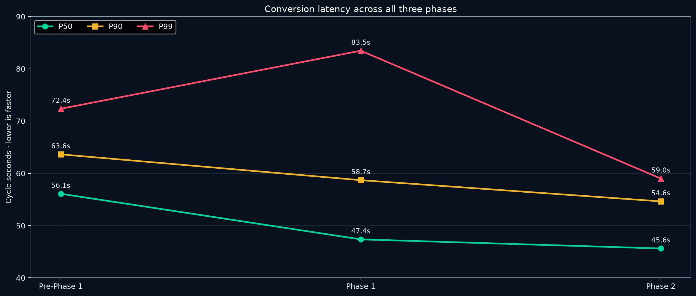
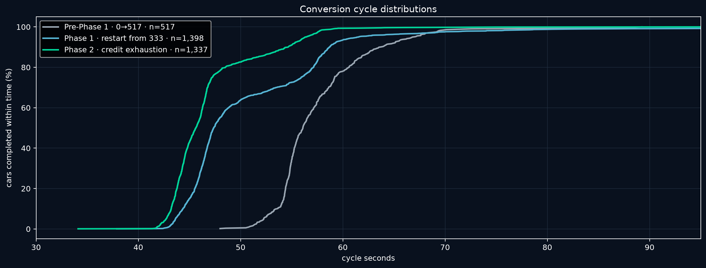
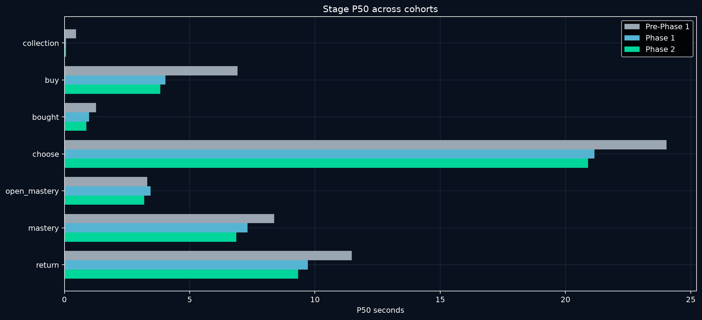
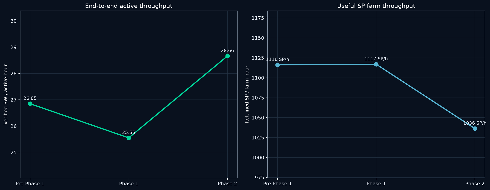
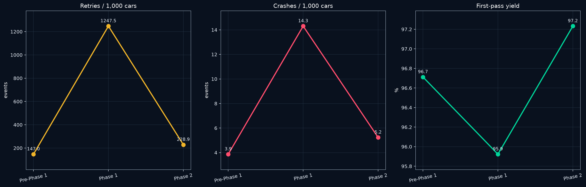
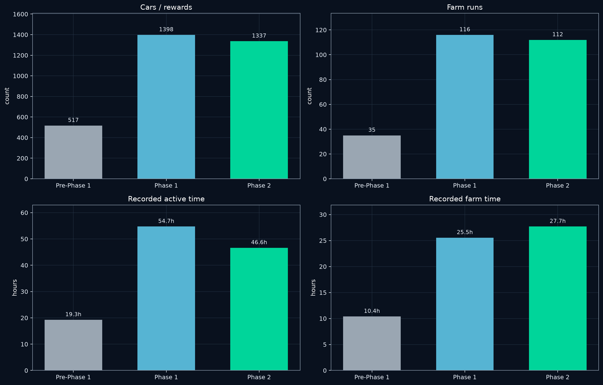

# FH6 Auto

Windows automation for the Forza Horizon 6 Super Wheelspin loop: farm Skill Points, buy the 95,000-CR Mad Mike Mazda, select the newest copy, claim and verify its 21-SP mastery path, bank the reward, and repeat. **F6 starts. F7 stops.**

## 1. Install and run

### Requirements

- Windows 10 or 11
- Python 3.10 or newer
- Forza Horizon 6 through Steam
- English game menus at 1920×1080
- The maxed 1998 Subaru Impreza 22B set as the only Favorite
- Mega Farm V6 share code `155 439 962`

### Install

1. Download and extract the latest release.
2. Run `Setup FH6 Auto.cmd` once. It creates a private Python environment, installs the required packages, and opens the dashboard.
3. For later runs, use `Start FH6 Auto.cmd`.

For development installs, clone the repository and run the same setup file. Tests require `requirements-dev.txt` and run with `python -m pytest`.

### Run

1. Open Steam and sign in.
2. Start FH6 Auto.
3. Choose a mode and target in Mission Control.
4. Put Forza in a supported home or festival state.
5. Press **F6**.
6. Press **F7** whenever you want the worker to stop safely.

The program can launch FH6 through Steam and resume after a crash. A visible cloud-sync gate always takes priority; it waits for synchronization and never chooses offline play.

### Production loop

1. Read the current SP balance.
2. Run Mega Farm V6 in full-run or headroom-aware top-up mode.
3. Buy exactly one Mad Mike Mazda through Car Collection.
4. Open My Cars → Recently Added and select the newest untouched copy.
5. Claim and visually verify all six required mastery nodes.
6. Record the Super Wheelspin reward and return to the next purchase.
7. At the configured cleanup interval, remove processed Mad Mikes and verify the filtered inventory.
8. In credit-limited mode, stop buying below 95,000 CR, finish any paid copy, top SP up to 999, remove the remaining Mad Mikes, verify zero, and stop.

Rewards stay saved; the program does not open the wheelspins.

### Safety and recovery

- Checks window identity, foreground focus, resolution, language, and expected screen before critical input.
- Uses OpenCV for calibrated visual states and OCR for variable numbers and text.
- Compares mastery-node interiors, excluding the changing focus border.
- Verifies each node changed from locked to owned before advancing.
- Checks the exact car, 95,000-CR offer, selected Buy action, and purchase confirmation.
- Never repeats an uncertain purchase.
- Requires two matching credit reads before a credit-limited purchase decision.
- Uses hybrid inventory tracking: verified rewards update immediately, then a fresh My Horizon read corrects the total.
- Saves checkpoints, error screenshots, failure causes, and recovery timing.
- Detects a stationary farm car and performs bounded reverse recovery.
- Keeps Discord rendering, analytics, screenshots, and account reads off the input-critical path where safe.

### Optional Discord reporting

Add a webhook in the dashboard to receive the live mission board and current game capture. The webhook is encrypted with Windows DPAPI for the current Windows user and is excluded from Git and release archives.

### Project map

| Path | Purpose |
|---|---|
| `FH6 Auto.pyw` | Mission Control desktop app |
| `fh6/` | Navigation, recognition, farming, recovery, analytics, and reporting |
| `forza_cycle.py` | Shared configuration and mission state |
| `recognition/`, `templates/`, `calibration/` | Screen and mastery references |
| `profiles/` | Farm profiles |
| `tests/` | Public regression suite |
| [`MODULES.md`](MODULES.md) | Module-level map |
| [`RECOGNITION.md`](RECOGNITION.md) | Recognition and calibration notes |
| [`CHART-METHODS.md`](CHART-METHODS.md) | Chart and metric conventions |
| [`SECURITY.md`](SECURITY.md) | Private-state and credential handling |

Private gameplay captures, `runs/`, `failures/`, `purchases/`, `LocalState/`, virtual environments, process identifiers, and Discord credentials stay outside Git.

## 2. Three-phase highlights

The operation contains three measured cohorts. The README keeps only the comparison; the [complete all-phase report](docs/full-operation-report/REPORT.md) contains the full timing, farming, finance, reliability, inventory, cleanup, methods, and evidence detail.

| Metric | Pre-Phase 1 · 0→517 | Phase 1 · restart from 333 | Phase 2 · credit exhaustion |
|---|---:|---:|---:|
| Cars / new Super Wheelspins | 517 | 1,398 | 1,337 |
| Farm runs | 35 | 116 | 112 |
| Recorded active time | 19.26h | 54.72h | 46.65h |
| Recorded farm time | 10.39h | 25.55h | 27.70h |
| Retained farm SP | 11,600 | 28,534 | 28,700 |
| Cycle P50 | 56.09s | 47.37s | **45.62s** |
| Cycle P90 | 63.63s | 58.69s | **54.64s** |
| Cycle P99 | 72.35s | 83.46s | **59.01s** |
| SW / active hour | 26.85 | 25.55 | **28.66** |
| Retained SP / farm hour | 1,116 | **1,117** | 1,036 |
| Farm-supported cars / hour | 53.15 | **53.19** | 49.34 |
| Conversion capacity | 61.92 cars/h | **64.48 cars/h** | 63.19 cars/h |
| First-pass yield | 96.71% | 95.92% | **97.23%** |
| Broad retries | **76** | 1,744 | 306 |
| Retries / 1,000 cars | **147.0** | 1,247.5 | 228.9 |
| Crashes | **2** | 20 | 7 |
| Crashes / 1,000 cars | **3.87** | 14.31 | 5.24 |
| Gross Mazda spend | 49.12M CR | 132.81M CR | 127.02M CR |

Phase 2 was the strongest conversion and recovery cohort: versus Phase 1, P50 improved **3.68%**, P90 **6.91%**, P99 **29.30%**, and active reward throughput **12.19%**. SP farming fell **7.22%**, leaving farm output as the main remaining bottleneck.

### Speed

### Throughput

### Reliability and workload

Across all three phases: **3,252 cars**, **3,252 verified rewards**, **263 farm runs**, and **308.94M CR** spent on Mazdas. The final verified Phase 2 state was **2,506 saved SW**, **230 WS**, **999 SP**, **42,170 CR**, and **zero Mad Mikes**.
