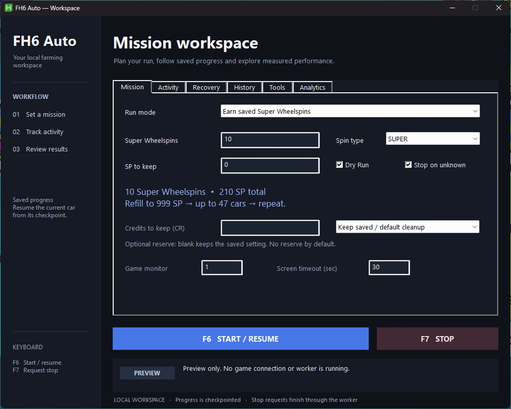
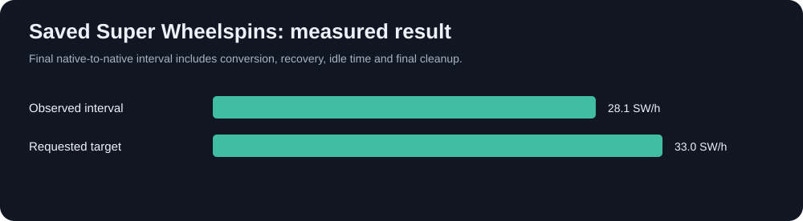
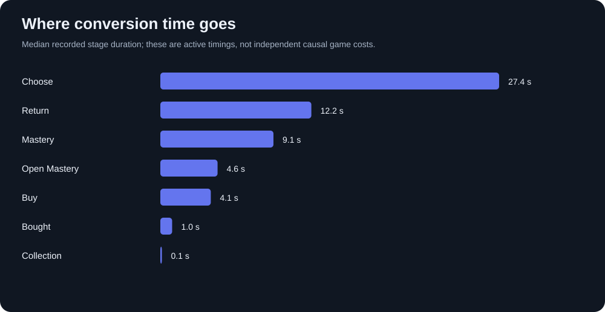
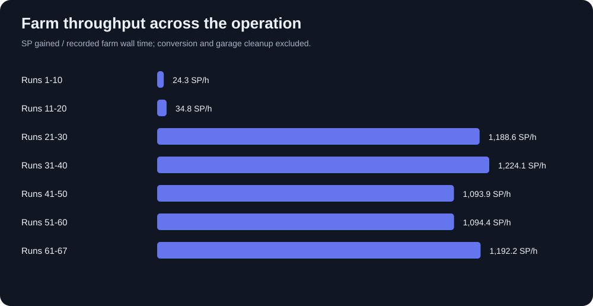

# FH6 Auto

### A desktop workspace for farming, saved rewards, and run analysis.

Farm Skill Points, convert mastery rewards into saved Super Wheelspins, and finish at your chosen credit reserve. Follow the live operation and inspect the measurements behind it.

[Download](https://github.com/an1dee3301/forza-horizon-6-farming/releases/latest) · [Get started](#get-started) · [Results](#latest-completed-operation) · [Data and methods](docs/latest-operation/REPORT.md) · [Modules](MODULES.md)

**F6** starts or resumes. **F7** requests a stop. The screenshot shows the actual desktop UI in disconnected preview mode.

## Latest completed operation

The September 27 operation finished paid cars, stopped above its **200 million CR reserve**, verified final Mad Mike cleanup empty, and stopped the worker.

| Native observation | Result |
| :--- | ---: |
| Credits at the stopping boundary | **200,078,025 CR** |
| Saved Super Wheelspins after cleanup | **2,197** |
| Regular Wheelspins after cleanup | **402** |
| Mad Mikes after final cleanup | **0** |

Final SP is **unavailable as a fresh native reading** because the subsequent observation encountered a video-card crash. The accounting estimate is 239 SP. Both owned Subaru 22Bs remain on the protected keep list.

### Saved reward throughput

**183 additional native saved Super Wheelspins in 6 h 30 m 41 s: 28.105 saved SW/hour.** This final observation interval includes farming, conversion, recovery, and final cleanup elapsed time. It is not the rate for the entire multi-day operation.

**33 saved SW/hour remains unproven.** It requires two adjacent native-inventory windows, each adding at least 100 saved spins, including all elapsed time.

### Where conversion time goes

The cleaned dataset contains **796 cycle records** with a **60.336-second median active cycle**. Choosing the car is the largest median stage at **27.375 seconds**, followed by return navigation at **12.203 seconds** and mastery at **9.141 seconds**. Stage medians are separate distributions and should not be summed as an exact cycle.

### Farming and data quality

| Audit result | Latest dataset |
| :--- | ---: |
| Recorded conversion cycles | 796 |
| Recorded farm rows | 67 |
| Farm rows flagged with partial timing | 12 |
| Retained cycle outliers | 26 |
| Journaled removals during final cleanup | 317 |
| Final cleanup wall time, including recovery | 32.46 min |

The goal counter and farm records differ by one; the report documents that gap. Long delays and outliers remain in the data. Recorded full-history farm throughput therefore differs substantially from selected recent runs. Active time, wall time, native balances, and accounting estimates remain separate.

[Read the quality audit and methods →](docs/latest-operation/REPORT.md) · [Browse sanitized data →](data/latest-operation/) · [Historical cohorts →](docs/HISTORICAL-RESULTS.md)

## Get started

### Requirements

- Windows 10/11, 64-bit Python 3.12, and AutoHotkey v2.
- Forza Horizon 6 through Steam, English menus, 1920×1080.
- Fully upgraded 1998 Subaru Impreza 22B with completed mastery, configured as the farm Favorite.
- Mega Farm V6 share code **155 439 962**.

### Install and run

1. Extract the [latest release](https://github.com/an1dee3301/forza-horizon-6-farming/releases/latest).
2. Run **Setup FH6 Auto.cmd** to install the pinned environment and open the dashboard.
3. Open Steam and the game. Choose your mission, target, reserve, and cleanup policy.
4. Put the game in a supported home or festival state, then press **F6**.
5. Press **F7** to stop. Use **Start FH6 Auto.cmd** for later sessions.

Source installs use the same setup file. See the [desktop UI guide](docs/DESKTOP-UI.md).

## One workspace, six views

| View | Purpose |
| :--- | :--- |
| Mission | Action, target, credit reserve, monitor, and cleanup settings |
| Activity | Completed cars, farm runs, saved inventory, and progress |
| Recovery | Evidence, checkpoint recovery, and purchase reconciliation |
| History | Previous activity and saved sessions |
| Tools | Individual farming, recognition, and conversion modules |
| Analytics | Timing distributions, throughput, failure costs, and exports |

### Reserve and cleanup

**Credits to keep (CR)** protects your stopping balance. The worker finishes a paid car, checks the next 95,000-CR purchase, and stops before crossing the reserve.

**Final cleanup only** keeps Mad Mikes during farming, then removes them together with per-removal checkpoints and a verified empty result. Reserve-based completion performs no terminal SP top-up. Blank settings preserve the saved configuration. [Behavior and CLI options →](docs/operations/credit-reserve.md)

### Production loop

1. Read SP and farm when more points are needed.
2. Buy one 95,000-CR Mad Mike Mazda.
3. Select the new copy and verify its six-node, 21-SP mastery path.
4. Record the saved Super Wheelspin and check the remaining credit budget.
5. At the reserve, finish the paid car, complete cleanup, verify inventory, and stop.

Purchases and rewards are checkpointed to avoid replay. The separate Wheelspin Lab opens saved spins.

### Protection and reporting

- Keep-list rules protect both owned Subaru 22Bs and configured cars.
- Native screen, account, focus, process, and receipt checks support recovery.
- A healthy game is not terminated. Crash recovery uses Steam and waits for synchronization.
- Discord webhooks are optional, encrypted with Windows DPAPI, and excluded from releases.

Automatic Wheelspin Lab actions remain disabled pending fresh live validation. The older protected-car sale incidents and corrected policy remain documented in the [historical Wheelspin report](docs/WHEELSPIN-OPERATION-2026-09-19.md).

## Reproduce the analysis

Normalized tables, audit findings, and graphs are versioned together. Original runtime evidence remains private and unchanged. Missing measurements stay missing; outliers are flagged, not silently discarded.

See [analysis commands and methodology](docs/latest-operation/REPORT.md), [chart conventions](CHART-METHODS.md), and the [optimization budget](docs/operations/throughput-budget-20260926.md).

## Development

| Path | Purpose |
| :--- | :--- |
| `FH6 Auto.pyw` | Desktop entry point |
| `Forza-Horizon-6-Wheelspin-Macro-main/Modules/LocalPanel.ahk` | Dashboard |
| `fh6/` | Farming, navigation, accounting, analytics, reporting |
| `tests/` | Regression suite |
| `data/latest-operation/` | Sanitized normalized tables |
| `tools/analyze_operation.py` | Reproducible analysis and charts |
| `docs/latest-operation/` | Findings, methods, and figures |

Install `requirements-dev.txt`, then run `python -m pytest -q -p no:cacheprovider`. Runtime smoke checks send no game inputs. See [release verification](RELEASE-CHECKLIST.md), [recognition notes](RECOGNITION.md), and [security](SECURITY.md).

Private captures, account identifiers, receipts, save data, credentials, and live runtime directories stay outside Git and release packages.
