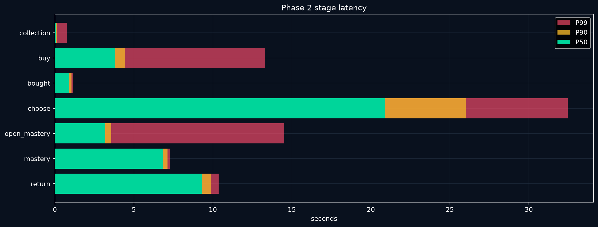
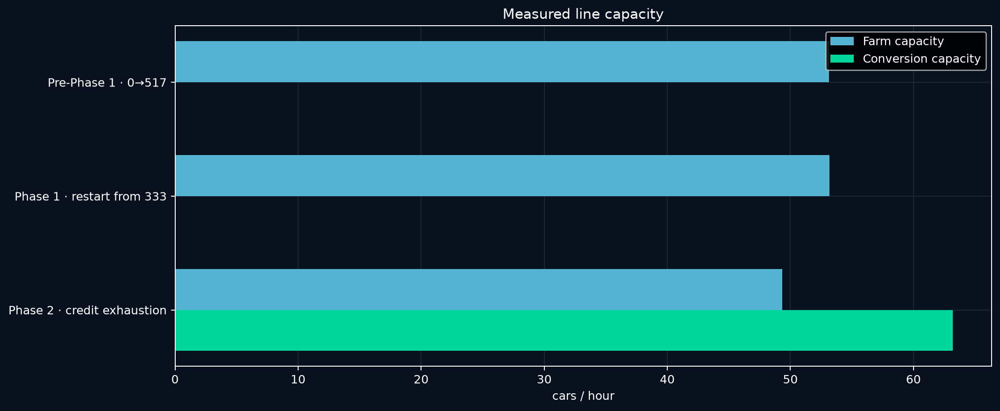
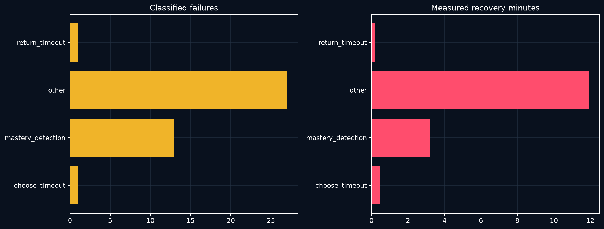
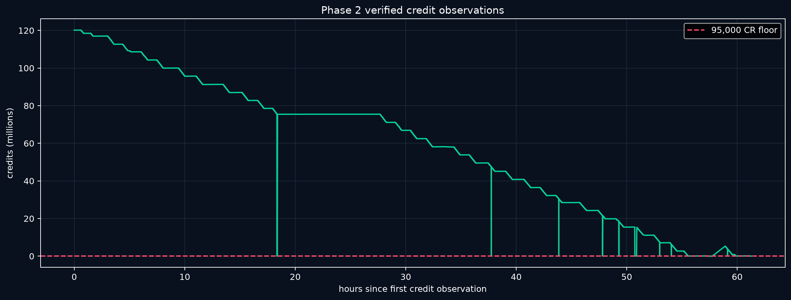

# FH6 farming operation — complete three-phase report

**Operation window:** 2026-09-11 to 2026-09-18 JST
**Account:** aichan3301
**Terminal state:** credits below the 95,000-CR purchase floor, SP restored to 999, and zero Mad Mike Mazdas verified

## Complete result

Across all three cohorts, the worker bought and completed **3,252 Mad Mike Mazdas**, verified **3,252 Super Wheelspin mastery rewards**, ran **263 SP farms**, and spent exactly **308,940,000 CR** on cars. The final Phase 2 account observation showed **2,506 saved Super Wheelspins**, **230 Wheelspins**, **42,170 CR**, **999 SP**, and **zero Mad Mikes**.

| Measurement | Pre-Phase 1 | Phase 1 | Phase 2 | All phases |
|---|---:|---:|---:|---:|
| Cars / verified mastery rewards | 517 | 1,398 | 1,337 | **3,252** |
| Farm runs | 35 | 116 | 112 | **263** |
| Recorded active time | 19.26h | 54.72h | 46.65h | **120.62h** |
| Farm active time | 10.39h | 25.55h | 27.70h | **63.64h** |
| Retained farm SP | 11,600 | 28,534 | 28,700 | **68,834** |
| Gross Mazda spend | 49,115,000 CR | 132,810,000 CR | 127,015,000 CR | **308,940,000 CR** |
| Broad retries | 76 | 1,744 | 306 | **2,126** |
| Crashes | 2 | 20 | 7 | **29** |

## Performance comparison

| Metric | Pre-Phase 1 | Phase 1 | Phase 2 | Phase 2 vs Phase 1 |
|---|---:|---:|---:|---:|
| Cycle P50 | 56.09s | 47.37s | **45.62s** | **3.68% faster** |
| Cycle P90 | 63.63s | 58.69s | **54.64s** | **6.91% faster** |
| Cycle P99 | 72.35s | 83.46s | **59.01s** | **29.30% faster** |
| SW / active hour | 26.85 | 25.55 | **28.66** | **12.19% higher** |
| Retained SP / farm hour | 1,116 | **1,117** | 1,036 | **7.22% lower** |
| First-pass yield | 96.71% | 95.92% | **97.23%** | **+1.31 pp** |
| Retries / 1,000 cars | 147.0 | 1,247.5 | **228.9** | **81.65% lower** |
| Crashes / 1,000 cars | **3.87** | 14.31 | 5.24 | **63.39% lower** |

Phase 2 delivered the best conversion median, tail latency, active reward throughput, and first-pass yield. Its farm rate regressed to **1,036 retained SP/h**, so SP production remained the limiting stage despite the conversion and recovery gains.

## Changes that mattered

- Pre-Phase 1 established the complete purchase, newest-car, mastery, return, and cleanup loop.
- Phase 1 reduced cycle P50 by **15.6%** from the initial cohort, but accumulated a much heavier retry and crash burden.
- Phase 2 kept the faster route and added matching credit reads, checkpoint reopening, bounded farm-stall recovery, terminal SP restoration, periodic garage cleanup, and more asynchronous reporting.
- Phase 2 cut retry incidence by **81.7%** and crash incidence by **63.4%** versus Phase 1 while improving P50/P90/P99.
- Mega V6 remained superior for bulk SP. Headroom-aware top-ups reduced cap exposure, but Phase 2's full farm rate did not reach the requested 1,404.8 SP/h target.

## Part I — Pre-Phase 1 and Phase 1 detail
**Period:** 2026-09-11 01:46 to 2026-09-14 16:48 JST
**Account:** aichan3301
**End state:** credit limit reached, final paid car completed, garage cleanup verified

### Final result

The operation produced **1,915 verified Super Wheelspin mastery rewards** from **1,915 purchased Mad Mike Mazdas**.

The first mission moved saved inventory from **0 to 517**. The inventory was then reduced to **333** after **184 spins were used**. The second mission verified **1,398** more mastery rewards. The last direct My Horizon read was **1,678 SW and 219 WS** at reward 1,396; two later verified mastery claims give a final hybrid inventory of **1,680 SW and 219 WS**.

The second mission's reward ledger would have reached 1,731 SW from the 333 opening balance. Actual inventory finished at 1,680, so **51 additional SW were used or otherwise reduced during that mission**. The known inventory reduction across both usage periods is **235 SW**.

| Final state | Value |
|---|---:|
| Saved Super Wheelspins | **1,680** |
| Wheelspins | **219** |
| Verified mastery rewards | **1,915** |
| Mad Mike Mazdas bought and processed | **1,915** |
| Credits | **87,720 CR** |
| Skill Points | **39 SP** |
| Level / prestige | **387 / 5** |
| Mad Mike cars remaining | **0, verified** |
| Recorded removal events | **1,288** |
| Removed in final automated pass | **78** |

### Production timeline

| Phase | Result | Farm runs | Cycle P50 | Cycle P90 | Cycle P99 | Active time | Recovery | Crashes |
|---|---:|---:|---:|---:|---:|---:|---:|---:|
| Pre-Phase 1 · 0→517 | 517 SW | 35 | 56.1s | 63.6s | 72.4s | 19.26h | 0.23h | 2 |
| Phase 1 · restart from 333 | 1,398 rewards | 116 | 47.4s | 58.7s | 83.5s | 54.72h | 7.33h | 20 |
| **Total** | **1,915 rewards** | **151** | — | — | — | **73.97h** | **7.56h** | **22** |

The end-to-end wall window was **87.04 hours**. Output averaged **25.89 verified rewards per recorded active hour** and **22.00 per wall hour**. The latest 20-car window finished at **P50 46.73s, P90 57.52s, P99 57.73s**, with **100% first-pass yield**.

The second phase cut the whole-cycle P50 by **15.6%** and P90 by **7.8%** versus the first phase. The stable final median was about 46.7 seconds; the 30-second target was not reached.

#### Per-stage distributions

| Phase | Stage | n | P50 | P90 | P99 | Mean |
|---|---|---:|---:|---:|---:|---:|
| 0→517 | Collection | 517 | 0.47s | 0.52s | 0.59s | 0.48s |
| 0→517 | Buy | 517 | 6.91s | 7.36s | 17.02s | 6.96s |
| 0→517 | Bought transition | 517 | 1.27s | 1.31s | 1.34s | 1.21s |
| 0→517 | Choose newest car | 517 | 24.03s | 29.98s | 35.84s | 25.33s |
| 0→517 | Open mastery | 512 | 3.31s | 3.62s | 13.44s | 3.48s |
| 0→517 | Mastery path | 517 | 8.38s | 8.58s | 9.00s | 8.40s |
| 0→517 | Return | 517 | 11.47s | 12.44s | 16.57s | 11.77s |
| Phase 1 · restart from 333 | Collection | 1,398 | 0.06s | 0.13s | 0.69s | 0.15s |
| Phase 1 · restart from 333 | Buy | 1,398 | 4.03s | 5.59s | 14.56s | 5.23s |
| Phase 1 · restart from 333 | Bought transition | 1,398 | 0.98s | 1.13s | 1.22s | 0.96s |
| Phase 1 · restart from 333 | Choose newest car | 1,398 | 21.16s | 29.04s | 34.25s | 23.45s |
| Phase 1 · restart from 333 | Open mastery | 1,394 | 3.44s | 3.81s | 14.94s | 4.02s |
| Phase 1 · restart from 333 | Mastery path | 1,398 | 7.31s | 11.46s | 11.67s | 8.35s |
| Phase 1 · restart from 333 | Return | 1,398 | 9.72s | 12.88s | 23.34s | 10.47s |

#### Recorded time allocation

| Phase | Farming | Conversion | Recovery | Sync | Total |
|---|---:|---:|---:|---:|---:|
| Pre-Phase 1 · 0→517 | 10.67h | 8.35h | 0.23h | unavailable | 19.26h |
| Phase 1 · restart from 333 | 25.69h | 21.68h | 7.33h | 0.01h | 54.72h |
| **Total** | **36.36h** | **30.03h** | **7.56h** | **0.01h recorded** | **73.97h** |

### Skill Point farming

Every Mazda consumed 21 SP. Both phases therefore consumed exactly **40,215 SP**. Farming retained **40,134 SP** over **35.94 farm-run hours**. The SP ledger reconciles exactly:

| Phase | Opening SP | Retained farm SP | SP consumed | Ending SP |
|---|---:|---:|---:|---:|
| Pre-Phase 1 · 0→517 | 12 inferred | 11,600 | 10,857 | 755 |
| Phase 1 · restart from 333 | 863 verified | 28,534 | 29,358 | 39 |
| **Total** | — | **40,134** | **40,215** | — |

The first opening balance is inferred from the exact identity `opening + farmed − consumed = ending`; it is not a direct OCR read.

#### Farm profile comparison

| Farm group | Runs | Retained SP | Active hours | Retained SP/h | Cars supported/h | Drive P50 |
|---|---:|---:|---:|---:|---:|---:|
| Mega V6 — natural completion | 31 | 10,936 | 8.84 | **1,237** | **58.9** | 917.2s |
| Mega V6 — intentional top-up | 25 | 4,876 | 4.01 | **1,216** | **57.9** | 600.2s |
| Untagged — natural completion | 1 | 373 | 0.31 | 1,200 | 57.1 | 915.8s |
| Untagged — intentional top-up | 1 | 242 | 0.21 | 1,133 | 54.0 | 600.6s |
| Untagged legacy | 11 | 3,718 | 3.29 | 1,131 | 53.8 | unavailable |
| Initial farm telemetry | 35 | 11,600 | 10.39 | 1,116 | 53.2 | unavailable |
| Mini V2 — natural completion | 29 | 3,712 | 3.46 | **1,072** | **51.0** | 298.6s |
| Mega V6 — interrupted | 8 | 2,893 | 2.78 | 1,039 | 49.5 | 917.3s |
| Untagged capped | 5 | 1,110 | 1.50 | 742 | 35.3 | unavailable |
| Mini V2 — interrupted | 5 | 674 | 1.14 | 591 | 28.1 | 298.7s |

Natural Mega V6 beat natural Mini V2 by **15.4%** on retained SP per active farm hour. Intentional Mega top-ups preserved almost the same throughput while avoiding oversized final runs. This is why the controller reverted from Mini V2 and kept Mega for both bulk and top-up work.

Telemetry flagged **18 capped runs** across both phases. Historic cap-loss magnitude was not measured consistently, so no exact SP-waste total is claimed.

### In-game finances

Each Mad Mike cost 95,000 CR. Exact gross purchase spend was:

| Phase | Cars | Gross Mazda spend |
|---|---:|---:|
| Pre-Phase 1 · 0→517 | 517 | 49,115,000 CR |
| Phase 1 · restart from 333 | 1,398 | 132,810,000 CR |
| **Total** | **1,915** | **181,925,000 CR** |

The first phase opening balance and detailed credit inflows were not recorded, so an all-period net credit bridge would be false precision. The first reliable phase-end balance was **92,352,392 CR**.

| Second-phase credit bridge | Amount |
|---|---:|
| Start after spins were used | 122,277,466 CR |
| Other in-game inflow required to reconcile | **+10,620,254 CR** |
| Mazda purchases | **−132,810,000 CR** |
| Final verified balance | **87,720 CR** |

The balance rose by **29,925,074 CR** between the first phase-end read and the second mission baseline, consistent with the user's wheelspin-opening period and any other intervening game income. During the second mission, the net balance decline was **122,189,746 CR**, equal to **87,403 CR per verified reward** after other in-game inflows. The final account was **7,280 CR short** of another Mazda.

### Reliability and recovery

The broad telemetry recorded **1,820 retry/recovery events**, **22 crashes**, and **7.56 hours** in recovery. Failure taxonomy was introduced during the second mission; **501 rows** are fully classified and account for **2.73 hours**. Remaining recovery time is legacy or unclassified and is not assigned to a cause.

| Classified cause | Events | Recovery time | Mean cost |
|---|---:|---:|---:|
| OCR fail | 341 | 97.2 min | 17.1s |
| Mastery detection | 71 | 21.3 min | 18.0s |
| Purchase fail | 27 | 20.4 min | 45.3s |
| Game crash | 2 | 6.8 min | 203.8s |
| Choose timeout | 7 | 5.2 min | 44.8s |
| Focus lost | 30 | 5.1 min | 10.3s |
| Unexpected screen | 9 | 3.8 min | 25.1s |
| Other | 5 | 2.3 min | 27.5s |
| Return timeout | 9 | 1.9 min | 12.5s |

OCR failures were the largest classified time sink in aggregate. Crashes were far less frequent but much more expensive per event. Only two crashes occurred after cause-level timing was added; the broad counter recorded 22 across both phases.

### Account progression and cleanup

The second mission began at **level 320, prestige 4** and ended at **level 387, prestige 5**: a displayed level change of **320 → 387 with prestige 4 → 5** (the total number of levels earned across the prestige rollover is not established here). The first phase ended at level 299, prestige 4.

Cleanup telemetry contains **1,288 recorded removal events**, including **78 in the final automated pass**. The final manufacturer-index check verified no Mad Mike Mazda remained. The difference between 1,915 purchases and recorded automated removals represents manual/early cleanup and periods before removal telemetry existed; it does not represent cars still present.

### Improvements that produced measurable gains

- Cycle P50 fell from **56.1s to 47.4s**; the last-20 P50 reached **46.7s**.
- Recently Added + newest-car selection kept duplicate selection constant-time.
- Direct house entry removed unnecessary return-home travel.
- Settings, Skill HUD, and assistance checks were cached per mission/process instead of repeated per car.
- Analytics, account reads, screenshots, Discord rendering, and diagnostics moved to background workers where safe.
- Purchase polling and screen recognition replaced many fixed waits while retaining stable-screen checks.
- Mastery navigation used direct pointer targets plus interior-only owned/unowned checks.
- Mega V6 bulk and shortened top-up modes reduced refill restarts and cap exposure.
- Mini V2 was tested for 34 recorded runs and rejected based on retained SP/hour.
- Credit checks required two matching reads and stopped at 87,720 CR.
- Crash recovery, Steam relaunch, focus recovery, and synchronized mission checkpoints prevented lost progress.
- Final cleanup removed every remaining filtered Mad Mike and verified zero inventory.

### Evidence quality

**Exact or directly verified:** purchase and mastery counts, fixed purchase price, cycle timestamps, farm pre/post SP, My Horizon inventory reads, second-phase credit baseline and final balance, final zero-car cleanup, level and prestige reads.

**Derived from exact records:** SP consumption, phase throughput, percentiles, gross Mazda spend, second-phase non-purchase inflow, and the final 1,680 SW hybrid value from a direct 1,678 read plus two later verified nodes.

**Incomplete:** first-phase opening credits, first-phase detailed credit inflows, cause-level failure telemetry before classification existed, exact historic cap loss, and removals before cleanup telemetry was introduced. Missing values remain unknown rather than zero.

### Inspectable data

- [`reviewed_snapshot.json`](reviewed_snapshot.json)
- [`phase_summary.csv`](data/phase_summary.csv)
- [`stage_percentiles.csv`](data/stage_percentiles.csv)
- [`farm_profiles.csv`](data/farm_profiles.csv)
- [`classified_failures.csv`](data/classified_failures.csv)

Raw logs, screenshots, process identifiers, purchase ledgers, and Discord credentials are intentionally excluded from Git.

## Part II — Phase 2 detail
Phase 2 completed on **2026-09-18 at 00:11 JST**. The worker processed **1,337** Mazdas, restored SP to **999**, removed the last Mad Mike, and verified the filtered garage empty. The purchase gate used three matching reads at **41,170 CR**; the latest later account observation was **42,170 CR**, still below the 95,000 CR purchase price.

### Result

| Measurement | Result |
|---|---:|
| New Super Wheelspins | **1,337** |
| Cars bought / processed | **1,337 / 1,337** |
| Final saved inventory | **2,506 SW · 230 WS** |
| Final SP | **999 / 999** |
| Farm runs | **112** |
| Gross Mazda spend | **127,015,000 CR** |
| Opening / latest credits | **120,157,670 → 42,170 CR** |
| Reconciled other credit inflow | **+6,899,500 CR** |
| Mad Mikes remaining | **0 verified** |
| Level / prestige | **302 · prestige 6** |

### Three-cohort comparison

| Cohort | Cars | Farms | Active | Wall | P50 | P90 | P99 | SW/active h | Farm SP/h | Retries | Crashes |
|---|---:|---:|---:|---:|---:|---:|---:|---:|---:|---:|---:|
| Pre-Phase 1 · 0→517 | 517 | 35 | 19.26h | N/A | 56.09s | 63.63s | 72.35s | 26.85 | 1116 | 76 | 2 |
| Phase 1 · restart from 333 | 1,398 | 116 | 54.72h | N/A | 47.37s | 58.69s | 83.46s | 25.55 | 1117 | 1,744 | 20 |
| Phase 2 · credit exhaustion | 1,337 | 112 | 46.65h | 61.34h | 45.62s | 54.64s | 59.01s | 28.66 | 1036 | 306 | 7 |

Historical wall time is **N/A** where the cohort-specific boundary was not preserved.

### Phase 2 speed

Cycle P50/P90/P99: **45.62s / 54.64s / 59.01s**. Latest-20 P50/P90: **47.29s / 56.41s**. First-pass yield: **97.23%**. Conversion capacity: **63.19 cars/h**.

| Stage | Pre-P1 P50 | P1 P50 | P2 P50 | P2 P90 | P2 P99 |
|---|---:|---:|---:|---:|---:|
| collection | 0.469s | 0.063s | 0.062s | 0.125s | 0.766s |
| buy | 6.907s | 4.031s | 3.828s | 4.437s | 13.304s |
| bought | 1.266s | 0.985s | 0.875s | 1.047s | 1.151s |
| choose | 24.031s | 21.157s | 20.906s | 26.012s | 32.469s |
| open_mastery | 3.313s | 3.438s | 3.187s | 3.563s | 14.515s |
| mastery | 8.375s | 7.312s | 6.860s | 7.125s | 7.281s |
| return | 11.468s | 9.719s | 9.328s | 9.891s | 10.368s |

### SP farming

The **112** Phase 2 farm runs retained **28,700 SP** in **27.70 active hours**: **1036 SP/h**, supporting **49.34 cars/h**. The 15% target from the 1,221.6 SP/h baseline was 1,404.8 SP/h and was not sustained phase-wide.

| Run type | Runs | Retained SP | Active | SP/h | Cars/h | Drive P50 | Drive P90 |
|---|---:|---:|---:|---:|---:|---:|---:|
| natural_completion | 71 | 20,565 | 19.96h | 1030 | 49.07 | 917.2s | 917.4s |
| intentional_top_up | 34 | 6,453 | 5.79h | 1115 | 53.11 | 639.2s | 836.4s |
| interrupted | 7 | 1,682 | 1.95h | 861 | 41.00 | 917.2s | 917.3s |

Estimated cap loss where instrumented: **70.9 SP**.

### Reliability

Broad counters: **306 retries**, **7 crashes**, **97.23% first-pass yield**.

| Cause | Events | Recovery | Mean cost |
|---|---:|---:|---:|
| choose_timeout | 1 | 0.5 min | 28.3s |
| mastery_detection | 13 | 3.2 min | 14.8s |
| other | 27 | 11.9 min | 26.5s |
| return_timeout | 1 | 0.2 min | 12.0s |

### Finance and cleanup

**120,157,670 opening + 6,899,500 other inflow − 127,015,000 purchases = 42,170 latest observed CR.** Cleanup telemetry recorded **1,330 removals**; terminal duplicate-off and manufacturer-index checks verified zero remaining.

### Evidence limits

Raw purchases, mastery rewards, cycle rows, farm pre/post SP, terminal SP, credit reads, and zero-car cleanup are directly recorded. Rates and percentiles are derived. Historical wall time, final credits, final SP, and final garage state are **N/A** for Pre-Phase 1 because cohort-specific terminal proof was not preserved. Phase 2 goal-active time is the persisted mission counter; asynchronous category timers have different scopes and are not summed into it.

## Consolidated evidence files

- [`reviewed_snapshot.json`](reviewed_snapshot.json) — combined source snapshot for all three phases
- [`data/all_phase_comparison.csv`](data/all_phase_comparison.csv) — one row per cohort
- [`data/phase_summary.csv`](data/phase_summary.csv) — original Pre-Phase 1 and Phase 1 summary
- [`data/stage_percentiles.csv`](data/stage_percentiles.csv) — Pre-Phase 1 and Phase 1 stage distributions
- [`data/phase2_stage_percentiles.csv`](data/phase2_stage_percentiles.csv) — Phase 2 stage distributions
- [`data/farm_profiles.csv`](data/farm_profiles.csv) — earlier farm profiles
- [`data/phase2_farm_profiles.csv`](data/phase2_farm_profiles.csv) — Phase 2 farm profiles
- [`data/classified_failures.csv`](data/classified_failures.csv) — earlier classified failures
- [`data/phase2_classified_failures.csv`](data/phase2_classified_failures.csv) — Phase 2 classified failures
- [`all_phase_comparison_analysis.json`](all_phase_comparison_analysis.json) — machine-readable comparison output

Raw logs, screenshots, local checkpoints, process identifiers, and Discord credentials are excluded from the public repository.
